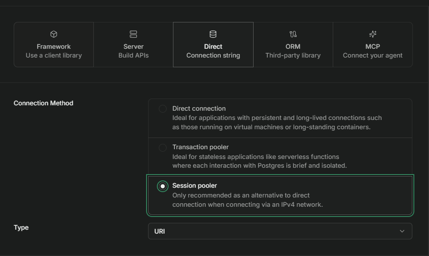
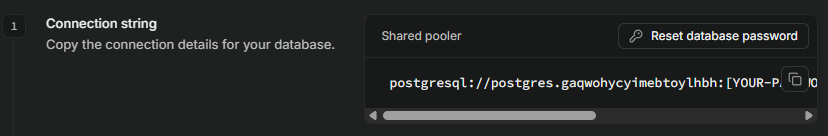

# Gerador e Injetor de Dados | Supabase


Script em Python que cria automaticamente a estrutura de um banco de dados no **Supabase (PostgreSQL)** e o popula com dados fictícios — clientes, vendedores, categorias, produtos, pedidos e itens de pedido — simulando o crescimento de uma empresa de e-commerce.

Serve como base para testes, prototipagem e criação de datasets para análise em ferramentas como **Power BI** e **SQL**.

## Sumário

- [Funcionalidades](#funcionalidades)
- [Estrutura do projeto](#estrutura-do-projeto)
- [Tecnologias e bibliotecas](#tecnologias-e-bibliotecas)
- [Modelo de dados](#modelo-de-dados)
- [Pré-requisitos](#pré-requisitos)
- [Configurando o banco no Supabase](#configurando-o-banco-no-supabase)
- [Instalação](#instalação)
- [Configuração](#configuração)
- [Como usar](#como-usar)
- [Autor](#autor)

## Funcionalidades

O `main.py` apresenta um menu interativo com duas opções principais:

**1 - Gerar Dados**
Cria as tabelas (caso não existam) e popula o banco do zero, na seguinte ordem:
1. Vendedores
2. Clientes
3. Categorias e Produtos (Hospitalar, Esportivo ou Eletrônico)
4. Pedidos e Itens de Pedido

**2 - Injetar Dados**
Insere novos registros em um banco já existente (novos clientes e novos pedidos com seus itens), simulando a movimentação contínua da empresa.

Em ambas as opções, é possível escolher entre:
- **Manual**: você informa as quantidades desejadas para cada etapa.
- **Automático**: o script gera quantidades padrão/aleatórias sem necessidade de input.

<details>
<summary>Exemplo de execução (clique para expandir)</summary>

```
=== Gerador e Injetor de Dados | Supabase ===

1 - Gerar Dados
2 - Injetar Dados
1
Preencher Banco de dados Supabase:
1 - Manualmente
2 - Automaticamente
R: 2
```

</details>

## Estrutura do projeto

```
projeto/
├── main.py                        # Ponto de entrada / menu principal
├── geradores/
│   ├── criacao_tabelas.py         # Cria as tabelas no banco
│   ├── cadastro_vendedores.py     # Gera vendedores fictícios (Faker)
│   ├── cadastro_cliente.py        # Gera clientes fictícios (Faker + IBGE)
│   ├── cadastro_categorias.py     # Insere categorias de produtos
│   ├── cadastro_produtos.py       # Insere produtos vinculados às categorias
│   ├── cadastro_pedido.py         # Cria pedidos aleatórios
│   └── cadastro_itens_pedidos.py  # Cria itens vinculados a cada pedido
└── dados/
    ├── dados_categorias.py        # Listas de categorias (Hospitalar/Esportes/Eletrônicos)
    └── dados_produtos.py          # Listas de produtos, categoria e preço
```

## Tecnologias e bibliotecas

| Ferramenta | Uso no projeto |
|---|---|
| [psycopg2](https://pypi.org/project/psycopg2/) | Conexão com PostgreSQL/Supabase |
| [python-dotenv](https://pypi.org/project/python-dotenv/) | Leitura de variáveis de ambiente |
| [Faker](https://pypi.org/project/Faker/) (`pt-BR`) | Geração de nomes, empresas e e-mails fictícios |
| [pyibge](https://pypi.org/project/pyibge/) | Dados reais de estados e municípios do Brasil |

## Modelo de dados

O script cria as seguintes tabelas relacionadas:

| Tabela | Descrição |
|---|---|
| `clientes` | Nome, cidade, estado, e-mail, data de cadastro, status |
| `vendedores` | Nome, equipe, data de contratação, salário |
| `categorias` | Categorias de produtos |
| `produtos` | Nome, categoria, preço, estoque |
| `pedidos` | Cliente, vendedor, data, status |
| `itens_pedido` | Produto, quantidade e preço unitário por pedido |

```
clientes ─┐
          ├── pedidos ── itens_pedido ── produtos ── categorias
vendedores┘
```

## Dashboard

Os dados gerados e injetados pelo script alimentam o dashboard no **Power BI** com visão no desempenho comercial: faturamento total, número de pedidos, ticket médio, % de atingimento de meta, evolução do faturamento ao longo do tempo, status dos pedidos e top 5 produtos. O dashboard está disponível em modo claro e modo escuro. 

**Modo Claro**


**Modo Escuro**


## Pré-requisitos

- Python 3.10+
- Uma conta e um projeto criado no [Supabase](https://supabase.com/) (ou qualquer PostgreSQL acessível)

## Configurando o banco no Supabase

1. Crie uma conta em [supabase.com](https://supabase.com/).
2. Crie uma nova organização e, dentro dela, um novo projeto — defina a senha do banco de dados nesse momento (guarde-a, ela será usada no `.env`).
3. Dentro do projeto, clique em **Connect** no topo da página.

   

4. Em **Connection Method**, selecione **Direct Connection** e, em **Type**, escolha a opção **Session pooler**.

   

5. Na seção Shared pooler, você verá a connection string com o placeholder [YOUR-PASSWORD] no lugar da senha. Antes de continuar, clique em Reset database password para definir (ou redefinir) a senha do banco — é ela que você vai usar no .env, já que a senha original não fica visível depois de criada.

   

## Instalação

```bash
git clone https://github.com/Sjs1459/pipeline-analise-dados-powerbi-python-sql.git
cd pipeline-analise-dados-powerbi-python-sql
pip install psycopg2-binary python-dotenv Faker pyibge
```

## Configuração

Crie um arquivo `.env` na raiz do projeto com as credenciais de conexão obtidas no Supabase:

```env
DB_NAME=seu_banco
DB_USER=seu_usuario
DB_PASSWORD=sua_senha
DB_HOST=seu_host
DB_PORT=5432
```

> ⚠️ Nunca faça commit do arquivo `.env` — adicione-o ao `.gitignore` para não expor suas credenciais.

## Como usar

```bash
python main.py
```

Siga as instruções do menu no terminal para escolher entre gerar a base do zero ou injetar novos dados, e entre o modo manual ou automático.

## Autor

Desenvolvido por **Samuel Jesus de Sousa**.

[GitHub](https://github.com/Sjs1459) - 
[LinkedIn](www.linkedin.com/in/samueljesussousa)
